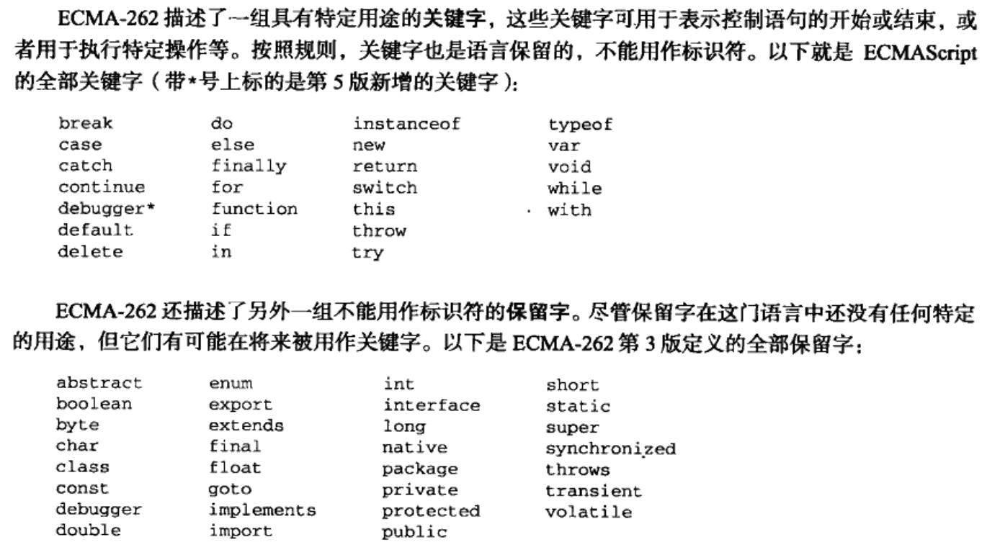
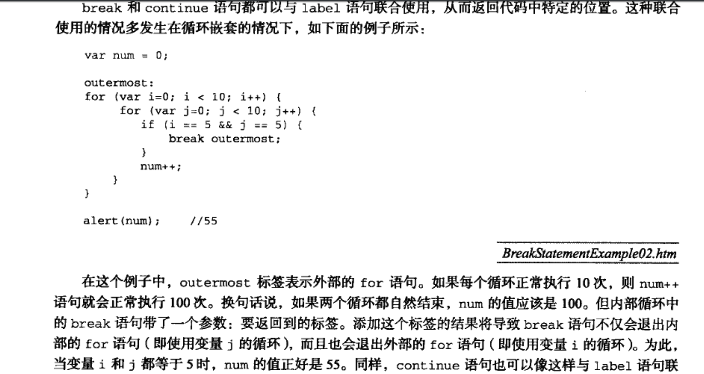
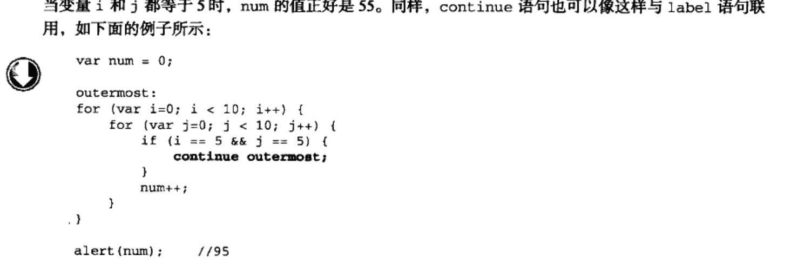

#                       JavaScript学习笔记

## 一、JavaScript简介

JS是一种专为网页交互而设计的一门脚本语言，它分为以下几个部分：

1、ECMAScript，由ECMA-262定义，提供核心语言功能；

2、DOM（文档对象模型），提供访问和操作网页内容的方法和接口；

3、BOM（浏览对象模型），提供与浏览器交互的方法和接口。

## 二、在HTML中使用JavaScript

### 1. < script>元素

< script>元素的六个属性：

1. async：可选。异步加载属性，属性。只对外部脚本有效，表示立即下载脚本，但不妨碍页面的其他操作。

2.charset：字符编码属性，可选。默认是utf-8编码，主要表示通过src属性指定的代码的字符集，大多浏览器会忽略它的值，所以很少有人使用。

3.defer：脚本延迟属性，可选。用来延迟脚本的执行时间，直到HTML文档已经全部被解析和显示之后再执行，只对外部脚本文件有效。

4.language：脚本类型属性，不是标准组成的一部分，已废弃。大多数浏览器会忽略这个属性，已没必要使用。

5.src：链接外部文件属性，可选。表示包含要执行代码的外部文件。注意，一旦设置src属性，script元素中编写的JavaScript代码就可能无效。

6.type：脚本类型属性，可选。默认值为text/javascript。可以看成language的替代属性，表示编写代码所使用的内容类型（也叫mime类型）。

使用< script>元素有两种方式：直接嵌入和用JS外部文件。

**直接嵌入：** 只需为< script>元素指定type属性，然后像下面一般放在元素内部：

< script type="text/javascript">

..........

< /script>

包含在< script>中的元素就会从上到下依次被解释。

**外部JS文件** ：导入外部JS脚本，一定要加上src属性。

例如：< script type="text/javascript" src="example.js">< /script>

另外，src属性还可以包含来自外域的JS文件。

例如：< script type="text/javascript" src="http:// www.somewhere. com/afile.js">< /script>

#### 1.1标签位置

一般来说，所有的< script>元素都应该包含在< head>元素中，例如：

```
<!DOCTYPE html>
<html>
<head>
    <title>Title</title>
    <style type=text/css >

    </style>
    <script type="text/javascript " src="example.js"></script>
</head>
<body>
<!--内容-->
</body>
</html>
```

但是对于那些JavaScript代码很多的页面来说，这会导致浏览器在加载页面的时候出现明显的延迟，为避免这一问题，现代web应用程序一般都把全部JavaScript引用放在< body>元素内容后面，例如：

```
<!DOCTYPE html>
<html>
<head>
    <title>Title</title>
    <style type=text/css >

    </style>
</head>
<body>
<!--内容-->
 <script type="text/javascript " src="example.js"></script>
</body>
</html>
```

#### 1.2延迟脚本

< script>的defer属性，用途就是表明脚本在执行时不会影响页面的构造。也就是说，脚本会

被延迟到整个页面都解析完毕后再运行。因此，在< script>中设置defer属性，相当于告诉浏览器立即下载，但延迟执行。例如：

```
<!DOCTYPE html>
<html>
<head>
    <title>Title</title>
    <script type="text/javascript " src="example.js" defer="defer"></script>
</head>
<body>
<!--内容-->
</body>
</html>
```

**注意：** defer属性只对外部脚本文件有效。

#### 1.3异步脚本

async只适用于外部脚本，并告诉浏览器立即下载文件，但与defer不同的是，标记为async的脚本不保证按照指定顺序执行。

`<script type="text/javascript" async src="example1.js" ></script>` 

`<script type="text/javascript" async src="example2.js" ></script>` 

像以上两个脚本文件，第二个脚本文件可能先于第一个脚本文件执行。指定async属性的目的是不让页面等待两个脚本下载和执行，从而异步加载页面其他内容。为此，建议异步脚本不要在加载期间修改DOM。 异步脚本一定会在页面的load时间前执行，但可能会在DOMContentLoaded时间触发之前或是之后执行。

#### 1.4在XHTML中的用法

可扩展超文本标记语言，即XHTML。不推荐使用，跳过。

### 2.嵌入代码与外部文件

最好使用JavaScript外部文件。

### 3.文档模式

IE5.5引入了文档模式的概念。文档模式：混杂模式和标准模式。混杂模式会让IE的行为与IE5相同，而标准模式与                                                                              IE的行为更接近标准行为。虽然这两种模式主要影响css，但是某些情况也会影响到JS的解释行为。随后其他浏览器纷纷效仿，IE有提出一种所谓的准标准模式，基本符合标准，但也不尽然。其中，混杂模式不值得推荐，在不同浏览器中这种模式的行为差异很大，如果不使用hack技术，跨浏览器的行为根本就没有一致性可言。

#### 4.< noscript>元素

早期浏览器都面临一个问题当浏览器不支持JS时如何做到让页面平稳地退化。解决方案是创造一个< noscript>元素，在不支持JS的浏览器中显示替代内容。这个元素可以出现在< body>中出现 < script>中的任何一个元素。在两种情况下才会显示：

 浏览器不支持脚本

浏览器支持脚本，但脚本被禁用

##  三、基本概念

### 1.语法

#### .区分大小写

#### .标识符

指变量，函数，属性的名字，函数的参数。其第一个字符必须是英文字母，数字或$，其他字符可以是字母，数字，下划线，美元符号。

**注意：** 不要把关键字、保留字、null、false、true

#### .注释

//单行注释         /*........................ */多行注释

#### .严格模式

ECMAScript5引入了严格模式的概念。严格模式是为JS定义了一种不同的解析与执行模型。在严格模式下，ECMAScript3中的一些不确定的行为将得到处理，而且对某些不安全的操作会抛出错误。启用严格模式，可以在顶部添加如下代码：”use strict”，在函数内部的上方包含这条编译指示，也可以指定在严格模式下执行。

#### .语句

语句结束以分号结尾。

### 2.关键字和保留字

 

 

### 3.变量

定义变量用var，如果省略了var，就是定义了全局变量，只要调用了一次函数，这个变量就有了定义，就可以在函数外部的任何地方被访问到。

可以使用一条语句定义多个变量，只要用逗号分隔开，如：

var  message =0,

​        age=29;

### 4.数据类型

ECMAScript中有5种简单数据类型（基本数据类型）：undefined、null、boolean、number和string。还有一种复杂数据类型—object,object本质上是由一组无序的名值对组成的。

**.typeof操作符** 鉴定变量的数据类型

**.Undefined类型** 在使用var声明变量但未初始化，这个变量就是Undefined。

**.null类型** 也只有一个值null，逻辑角度是一个空的对象指针，使用typeof返回object的原因。如果定义的变量用于保存对象，最好初始化为null而不是其他值。由于undefined是派生于null，所以两者相等性测试为true。不必显示的设置一个变量的值为undefined，但是null正相反，如果一个变量将用于保存对象，最好设置为null，不仅体现null作为空对象指针的惯例，也可以区分两者。

**.Boolean类型** 该类型有两个值：true和false。（区分大小写）

EMCScript中所有类型的值都有与之等价的值。将值转化为Boolean，可以调用Boolean（）

 

例如：var a="hello" ;   var b=Boolean(a)  ;//b=true

**.Number类型** 最基本的数值格式是十进制

​                          八进制字面值的第一位是0，如：070（十进制为56）。如果字面值的数值超出了范围，那么前面的0将被自动忽略，后面的数字按照十进制来算。如：079（值为79）。

​                         十六进制字面值前两位必须是0x，后跟十六进制数字，字母不分大小写。如：0xF(十进制为15)

**注：** n/a(或是N/A)表示不适用.

**1.浮点数值** 

用e表示法表示为e(或E)前面的数乘以10的e(或E)后面数字的乘方。如：3.14e7=31400000.

浮点数值的最高精度为17位小数。

**2.数值范围** 

最小值：5e-324   最大值：1.796......e+308    负无穷:-Infinity     正无穷:Infinity

**3.NaN**  此数值表示一个要返回却未返回的数值，每个NaN数值都不同。

isNaN()函数：此函数可以接受一个参数，而后判断其是否“不是数值”。如：isNaN(NaN)=true,isNaN(true)=false

注意：Boolean值也可以转换成数值。

**4.数值转换** 有3个函数可以把非数值转换为数字：Number（）、parseInt（）和parseFloat（）。第一个可以用于任何数据类型，后两个函数式专门用于把字符串转换成数值。这3个函数对于同样的输入会有返回不同的结果。

*Number()函数转换规则：* 

true和false返回1和0；

数值时就简单的传入和返回。

如果是null返回0；

如果是undefined，返回NaN。

若是字符串，如果是其中包含整数和浮点数，将会转换成数值，011会转换成11，前面的零会被忽略，十六进制转化成十进制。字符串是空的话，转换成0；其他字符串转换成NaN。

*parseInt()函数转换规则：*

处理整数时更常用parseInt（）函数。它会忽略字符串前面的空格，直到找到第一个非空格字符。如果第一个字符不是数字字符或负号，parseInt（）就会返回NaN，用parseInt（）转换字符串会返回NaN。如果 字符是数字字符，parseInt（）会继续解析第二个字符，直到解析完所有的后续字符或者遇到了一个非数字字符。并且能够识别各种格式(如八进制、十六进制等)。如：parseInt(“1234blue")=1234。

这个函数还可以提供第二个参数，表示按几进制转换。如：parseInt("AF",16)=175

*parseFloat()函数转换规则：* 

与ParseInt（）函数类似，parseFloat（）函数也是从第一个字符开始。一直解析到字符串末尾，或者解析到遇见一个无效的浮点数字字符为止，字符串的第一个小数点是有效的，而第二个小数点就是无效的了，22.34.5会被解析成22.34.此外，两个函数的区别在于它始终都会忽略前导的零。且只解析十进制值，因此没有用第二个参数指定基数的用法。如果字符串是可解析为整数的值，parseFloat（）会返整数。且其始终会忽略前导的0，所以十六进制格式的字符串总会被解析成0。例如:parseFloat("0xF")=0

**.string类型** 

字符串可以由单引号或双引号表示（两种无差别），但是单引号必须以单引号结束，双引号必须以双引号结束。

 

任何字符串的长度都可以通过访问其length属性获得。

例如：var a="It is an apple"; a.length=11;

ECMAScript中字符串是不可变的，字符串一旦创建，值就是不能改变的。要改变首先要销毁原来的字符串，然后再用另一个包含新值的字符串值填充该变量。例如：a=a+"pen"; //a="It is an apple pen"

**转换为字符串** 

使用toString（）方法，返回相应值得字符串表现。 数值、布尔值、对象和字符串本身都有，但是null和undefined值没有这个方法。通常不需要参数，数值除外，一般返回十进制，加上基数可以返回八进制和十六进制。在不知道要转换的是不是null或undefined的情况下，可以使用转型函数string（），这个函数能够将任何类型的值转换为字符串，遵循下列转换规则：如果值有toString（）法，则调用该方法（没有参数）并返回相应的结果；如果值为null，则返回null，如果值是undefined，则返回undefined。 要把某个值转换为字符串，可以使用加好连接符将它与字符串("")链接起来。

例如：var num =10

​           num.toString()   //"10"

​           num.toString(2)  //"1010"

​           num.toString(8)   //"12"

​           String(num)         //"10"

**.Object类型** 

对象其实就是一组数据和功能的集合。可以通过new操作符后跟要创建的对象类型的名称来创建。而创建object类型的实例并未其添加属性和方法，就可以创建自定义对象，若是不传递参数，可以省略圆括号，但不推荐如此。

 仅仅创建实例并没有什么用处，但关键是理解一个重要的思想：在ECMAScript中，object类型是所有实例的基础。Object类型所具有的的任何属性和方法也同样存在于具体的对象。

 Var o=new object(); 

Object的每一个实例都具有下列属性和方法。

 Constructor：保存着用于创建当前对象的函数。对于前面的例子，构造函数（constructor）就是object（） 

hasOwnProperty（propertyName）:用于检给定的属性在当前对象实例中（而不是在实例的原型中）是否存在。参数属性（propertyName）必须以字符串形式指定。

 isPropertyOf(object):用于检查传入的对象是否是另一个对象的原型。

 propertyIsEnumerable(propertyName)：用于检查给定的属性是否能够使用for-in语句来枚举。与             hasOwnProperty()方法一样，作为参数的属性名必须以字符串形式指定。

 toLoacleString():返回对象的字符串表示。该字符串与执行环境的地区对应。

 toString（）：返回对象的字符串表示。

 valueOf（）：返回对象的字符串、数值或布尔值表示。通常与toString（）方法的返回值相同。

 Object是所有对象的基础，因此所有对象都具有这些基本的属性和方法。

### 5.操作符

#### 1.一元操作符

##### 1.递增和递减操作符（++，--）

运算规则与C++相同。

递增递减操作不仅使用与数字值，还可以用于字符串、布尔值、浮点数值和对象。

遵循下面的规则： 

包含数字的字符串，先转换成数字，在操作。

不包含数字的字符串，将变量的值设置为NaN。

字符串变量变成数值变量布尔值false转换成0，布尔值true转换成1，浮点数值时，直接执行加减1操作。

 对象时，先调用对象的valueOf（）方法以取得一个可供操作的数值。如果结果是NaN，再调用toString()进行操作。

##### 2.一元加和减操作符

一元操作符以一个加号（+）表示，放在数值前面，对数值不会产生任何影响，

var num=25; num=+num //结果仍是25 

对非数值应用一元操作符，就像使用number（）转型函数一样对非数值进行转换。

False和true被转换成0和1，字符串按照他书的规则进行解析，对象先调用valueOf（）和toString（）方法进行转换。

一元减操作符主要用于表示负数，var num=25;num=-num//变成了-25；一元加减操作符主要用于算术运算。也可以用来转换数据类型。

#### 2.位操作符

**1.按位非（NOT）**

由一个波浪线（～）,执行结果就是返回数值的反码。对25执行按位非操作，得到-26.验证了按位非得本质：操作数的负值减1.  

**2.按位与（AND）** 

由一个和号字符（&）表示。就是讲两个数值的每一位对齐。连个操作数的每一位进行与操作。

（1&1得1,1&0得0，0&1得0，0&0得0）

 **3.按位或（OR）**

 按位或操作符由一个竖线符号（|）对两个数值进行或操作。 

（1|1得1,1|0得1，0|1得1，0|0得0）

**4.按位异或（XOR**）

由一个插入符号(^）对两个操作数的每一位进行按位异或操作。

（1^1得0,1^0得1，0^1得1，0^0得0）

**5.有符号的左移（运算符为<<）** 

如var a =2; var b=a<<5;  //二进制a为10，二进制b为1000000，所以b为64

 **6.有符号的右移(运算符为>>)**

如var a =64; var b=a>>5;  //二进制a为1000000，二进制b为10，所以b为2

**7.无符号的右移（运算符为>>>）**

此运算符表示所有的32位数字全部向右移。

如：如var a =-64; var b=a>>>5;  //b=134217726

#### 3.布尔操作符

**1.逻辑非（！）**

如果操作数是任意非0数值、一个非空字符串、一个对象，则返回false，其他全部返回true.

**2.逻辑与（&&）** 

当时布尔值的时候按与的操作进行，如果有一个操作数不是布尔值的情况下，就不一定返回布尔值，遵循以下原则：

 第一个操作数是对象，则返回第二个操作数；

第二个操作数是对象，则只有在第一个操作数的求值结果是true时，才返回该对象。

两个操作数都是对象，则返回第二个操作数；

如果有一个操作数是null、NaN、undefined则分别对应的返回他们。

 逻辑与操作属于短路操作，如果第一个操作数能够决定结果，就不会对第二个数求值。如果第一个操作数是false，无论第二个操作数是什么都不会是true了。

**3.逻辑或(||)**

如果一个操作数不是布尔值，逻辑或也不一定返回布尔值，；

如果第一个操作数是对象，返回第一个操作数，

第一个操作数的求值结果为false，则返回第二个操作数，

两个都是对象，返回第一个操作数，

两个都为null、NaN、undefined，则返回分别对应。

逻辑或也是短路操作，第一个操作数是true的话，不会对第二个操作数求值。首先被赋予第一个值，当地一个是null时，变量才会被赋予第二个值。经常会使用这个方法。

#### 4.乘性操作符

乘号(*)，除号(/)，除余(%)

#### 5.加性操作符

**加法（+）** 

Infinity加-infinity，返回ＮａＮ。

＋０加＋０，返回＋０，

－０加＋０，返回＋０；

如果一个操作数是字符串，应用如下规则，都是字符串，将两个字符串拼接；只有一个是字符串，把另一个操

作数转换为字符串，然后再将两者拼接起来。

一个操作数是对象、数值或布尔值，调用ｔｏＳｔｒｉｎｇ（）函数转换成字符串，对于是undefined和null，则分别调用String（）函数并取得字符串“undefined”和“null”。

**减法（-）**

一般算法不提.....

如果有一个操作数是字符串、布尔值、null或undefined，则在后台用Number()函数将其转换为数值，再按前面的规则进行计算。

如果有一个操作数是对象，则调用valueOf（）方法取得对象的数值，如果得到的是NaN，则减法的结果就是NaN，如果对象没有valueOf（）方法，则调用toString（）方法得到的字符串转换为数值。

#### 6.关系操作符

大于(>)、小于(<)、大于等于(>=)、小于等于(<=)四种运算符

特别注意：无论什么和NaN相比，结果都返回false。

数值直接比较，字符串时，比较字符串的字符编码值。一个操作数是数值，将另外一个操作数也转换为数值，进行比较。如果一个操作数是对象，则调用valueOf()方法，得到数值在进行比较。如果对象没有valueOf（）方法，则调用toString（）方法，并用得到的结果根据前面的规则进行比较。若是布尔值，将其转换为数值在比较。

#### 7.相等操作符

**相等(==)和不相等(!=)**

特别注意：无论什么和NaN相比，结果都返回false。

null和undefined是相等的；如果两个操作数都是对象，则判断它们是否指向同一对象，若是，则返回true，否则返回false。

其他运算规则同上。

**全等(===)和不全等(!==)**

全等指在转换前就要数值相等，即既要操作数数值相等，也要其类型相等。

#### 8.条件操作符

var a=(一式) ? num1:num2;

表示看一式的结果的Boolean值，若为true，则将num1赋值给a，反之，则将num2赋值给a。

#### 9.赋值操作符(=)

与C++操作一样

#### 10.逗号操作符

使用其可以在一条语句中执行多个操作，例如：

var num1=1,num2=2,num3=3;

### 6.语句

#### 1.if语句

与C++一样

#### 2.do-while语句

与C++一样

#### 3.while语句

与C++一样

#### 4.for语句

与C++一样

#### 5.for-in语句

一种精准的迭代语句，可以用来枚举对象的属性。 

for(property in expression) statement;  

for(var propName in window){

document.write(propName)   }

返回window属性并赋值给propName，直到属性被枚举一遍，但是往往没有顺序而言，也就说顺序随浏览器而不同。若迭代对象时null或undefined，会抛出错误。ECMASciprt更正了，不会错误，只是不执行循环体了。为兼容性，最好先确认对象的值是不是null或undefined。

#### 6.label语句

在代码中添加标签，以便将来使用，一般与for语句等循环语句配合使用。

使用方法：label: statement

例如：start:for(var i=0;i<10;i++){  alert(i);  }

#### 7.break和continue语句

与C++一样

break和continue语句与标签配合使用





#### 8.with语句

 

#### 9.switch语句

与C++相似，但是switch后面的括号里可以放不只是数值型数据类型，而是任何数据类型。其次，case的值不一定是常量，可以是变量，甚至是表达式。


### 7.函数

定义函数：function 函数名（参数1，参数2，........参数n）

​                   {       statement    }

调用函数：函数名（参数1，参数2，........参数n）；

注意：位于return后面的代码不会执行。

  

#### 1.理解参数

ECMAScript函数参数和别的语言不同，不介意传递进来多少个参数，也不在乎数据类型，即使定义两个，在调用的时候可以使一个，三个甚至没有。在ECMAScript中参数在内部是用一个数组传递的，函数接受始ECMAScript终都是这个数组，不关心这个数组包含哪些参数。函数通过arguments对象来访问这个参数数组。从而获取传递给函数的每一个函数。arguments对象与数组类似，可以使用方括号语法访问每一个元素。如arguments[0]等。

function add(){ 

 alert(arguments[0]+arguments[1]);}

add(10,20)     //警告框就会出现30

 

arguments的值永远与对应参数的值保持同步。例如：

 

#### 2.没有重载

ECMAScript函数不想传统意义那样实现重载。若定义了两个名字相同的函数，则该名字属于后定义的函数。

## 四、变量、作用域和内存问题

ECMAScript变量包括两种不同数据类型的值：基本类型值和引用类型值。基本类型值指的是简单的数据段，引用类型值指的是那些可能由多个值构成的对象（对象类似于数据结构）。 将值赋给变量，解析器必须确定这个值时基本类型值还是引用类型值。Undefined，nullboolean，number和string是基本类型值，是按值访问的，因为可以操作保存在变量中的实际的值。 引用类型的值是保存在内存中的对象。与其他语言不通，JS不允许直接访问内存中的位置，既是不能直接操作对象的内存空间。操作对象时，实际上是在操作对象的引用而不是实际的对象。引用类型的值时按引用访问的。很多语言将字符串以对象形式表示，因此被认为是引用类型，ECMAScript放弃这一传统。

#### 1.基本类型和引用类型的值

**1.动态的属性** 

 

但是我们不能给基本类型的值添加属性。

**2.复制变量值** 

从一个变量向另一个变量复制基本类型值时相当于复制一个副本。

从一个变量向另一个变量复制引用类型值时，同样也会将存储在变量对象中的值复制一份放到为新变量分配的空间中。但这个值的副本实际上是一个指针，指向存储在堆中的一个对象。复制结束，两个变量实际上将引用同一个对象。因此，改变其中一个变量，就会影响另一个变量。

 

**3.传递参数** 

ECMAScript中函数的参数都是按值传递的。把函数外部的值复制给函数内部的参数，相当于把一个变量复制到另一个变量。基本类型值的传递如同基本类型值的复制，引用类型值如同引用类型复制。访问变量有按值和按引用两种方式，而参数只能按值传递。基本类型值传递，值被赋值给一个局部变量即参数，引用类型值传递，会把值在内存中地址复制给一个局部变量，因此这个局部变量的变化会反映在函数的外部。

 

**4.检测类型**

基本类型值用typeof，引用类型值用instanceof

 

#### 2.执行环境及作用域

